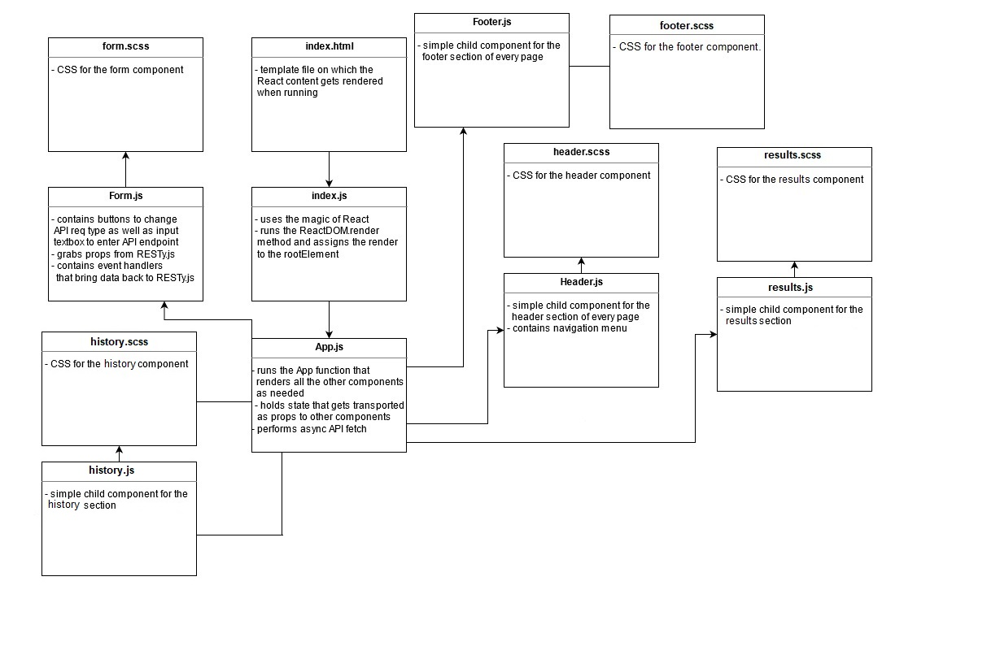

# RESTy

RESTy application, written in React. The application will be an API testing tool that can be run in any browser, allowing a user to easily interact with APIs in a familiar interface.

The app is about connecting RESTy to live APIs, fetching and displaying remote data. Our primary focus is to service GET requests

## Technologies:

- React js
- SASS
- Eslint
- jsDoc
- GitHub pages

## Prerequisites:
for the application to woek, in the terminal type the following:

- npm install
- npm start

## Deployed link:

The app is deployed using github pages.

https://ashjan-401-advanced-javascript.github.io/resty/

## UML

