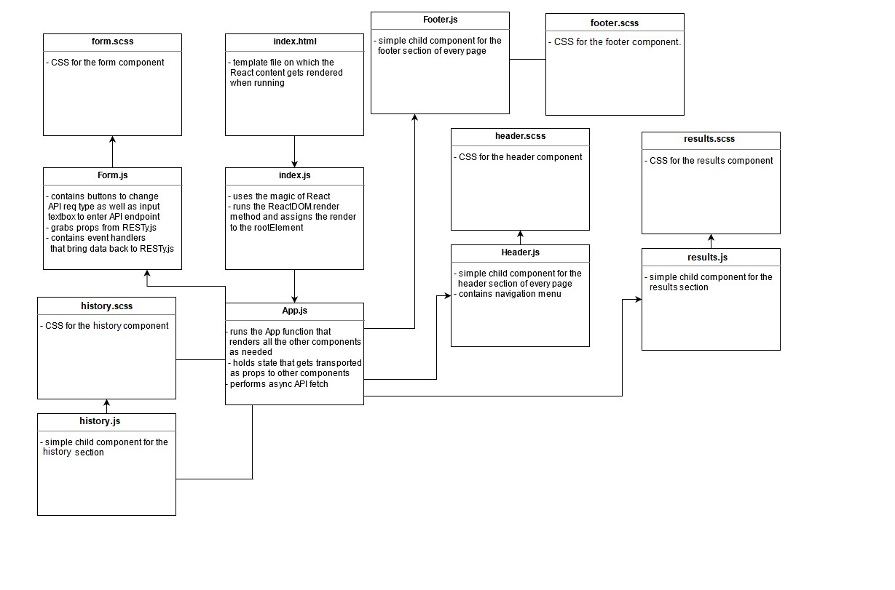

# RESTy

RESTy application, written in React. The application will be an API testing tool that can be run in any browser, allowing a user to easily interact with APIs in a familiar interface.

## Technologies:

- React js
- SASS
- Eslint
- jsDoc

## Prerequisites:
for the application to woek, in the terminal type the following:

- npm install
- npm start

## UML

